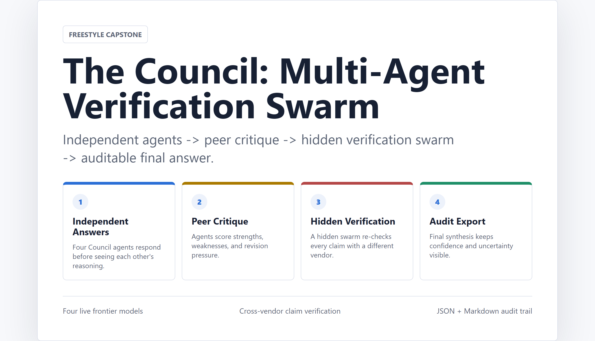
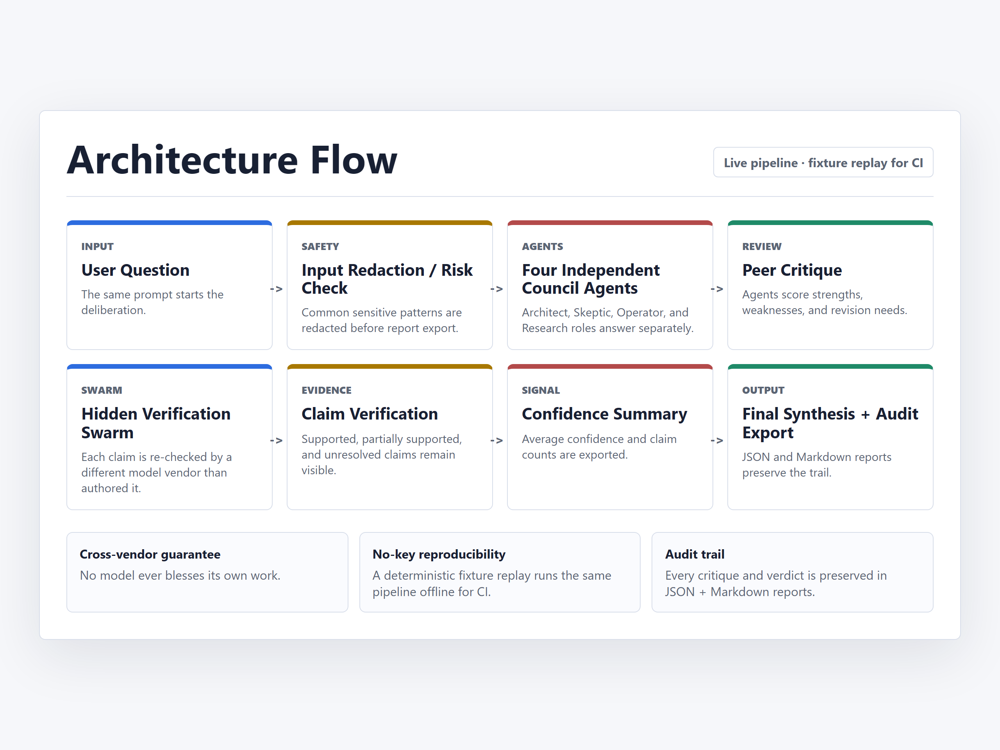

# The Council: A Multi-Agent Cross-Vendor Verification Swarm

**Subtitle:** Four frontier models answer independently, critique each other, and a hidden swarm re-checks every claim with a *different* AI vendor — turning one confident answer into an auditable deliberation.

**Track: Freestyle**

> Public code + setup: `TODO_PUBLIC_REPO_URL` · Demo video (≤5 min): `TODO_YOUTUBE_VIDEO_URL`

<!-- Kaggle: attach docs/img/cover.png as the required cover image and docs/img/architecture.png
     to the media gallery; the relative links below render on GitHub. -->

## The Problem

AI assistants return one polished answer even when the question is ambiguous, high-stakes, or evidence-sensitive. That single answer hides three things a careful user actually needs: which claims were genuinely checked, where the model was uncertain, and where it might be confidently wrong. Worse, the usual fix — asking a model to grade its own output — lets the same system that made an error also bless it. Self-grading is not verification.

## The Solution

The Council replaces one unchecked answer with a transparent, multi-stage deliberation. Four Council agents — Claude, GPT, Gemini, and Grok — answer the same question independently, each cast in a distinct role (operations/feasibility, practical tradeoffs, assumption/edge-case, and a contrarian verifier). They then peer-review each other and cast an explicit vote in which **no model may vote for itself**. Finally, a hidden **Verification Swarm** extracts the factual claims embedded in those answers and re-checks each one — crucially, with a model from a *different vendor than authored it* — before a synthesis step combines everything into a final answer that carries its confidence scores, unresolved claims, and a full audit trail.

The project is deliberately more harness than model: the LLM is roughly 10% of it, and the other 90% is the surrounding machinery — input redaction, role separation, a tool allowlist, claim extraction, cross-vendor verification, weighted decision scoring, and audit export. That behavioral contract lives in a durable Gherkin spec (`specs/verification.feature`), so the *spec* is the source of truth and the code is replaceable.

The live, four-provider system is the project and the demo (shown in the video). For anyone without API keys, a deterministic **fixture mode** (`npm run demo:fixture`) replays the same pipeline shape over local, **clearly-labeled simulated** data so the architecture is reproducible offline — a CI and "run-it-without-my-keys" path, never presented as live results.

## Why Multi-Agent Verification

More agents do not automatically mean better answers — coordination has a cost, so the right default is to start simple and only split when one agent hits a real boundary. High-stakes verification *is* that boundary. The value is precisely the disagreement, critique, and claim-checking that a single self-grading prompt collapses. So the pipeline "slices the elephant" into generation → critique → claim extraction → evidence checking → synthesis, keeping each step's context small and making overconfidence *inspectable*: the report shows what was supported, what was only partial, and what stays unresolved. That is effective trust, not a binary pass.

## Where This Matters: A Concrete Use Case

Picture a compliance analyst at a mid-size lender asking an AI whether a new marketing campaign triggers disclosure requirements. A single-model answer arrives polished and cites two regulations — one applied correctly, one subtly misread. The analyst can't tell which is which; neither can the model that wrote it. Run the same question through the Council and the failure mode changes shape: four models answer independently (disagreement itself is signal), the swarm extracts each regulatory claim and hands it to a *different* vendor to re-check, and the misread citation comes back **Refuted** with the reasoning attached — while the claims nobody could verify stay visibly *unresolved* instead of silently blessed. The analyst doesn't get "trust me"; they get a JSON audit trail they can attach to the decision record and a Markdown diff a reviewer can skim in two minutes. That's the pattern anywhere a wrong answer is expensive — regulatory checks, medical triage summaries, security advisories, due-diligence research: not a smarter oracle, but a deliberation you can *inspect*.

## Architecture

The verification flow runs seven stages: (1) input redaction and risk classification; (2) four independent Council answers; (3) peer critique; (4) hidden-swarm claim extraction; (5) per-claim verification — cross-vendor in live mode; against fixture evidence offline; (6) a confidence summary; and (7) final synthesis with audit export.

Live mode is served by an Express API plus a **separate** `shadow-council` verifier service behind a React 19 + Vite UI that renders the Council flow live — most agents' answers stream token-by-token (Grok returns its Round-1 answer on completion), and verification verdicts, confidence, and audit details appear as the run progresses. The cross-vendor guarantee is concrete: the verifier picks a checker from a different vendor than the claim's author and rotates across whichever providers are configured. The no-key offline mode adds a deterministic engine (`lib/`), reproducibility commands, smoke tests, a read-only MCP-style stub, and a reusable verification skill. Every run emits a machine-readable JSON trajectory (every critique and verdict) plus a human-readable Markdown "vibe diff," written atomically so results are reproducible and diffable.

## A Real Run: What the Swarm Catches (and What It Doesn't)

To write this section I drove the live system, headless, on three hard questions and read every output. Web search was off for this run, so verification here is the models cross-checking each other, not external lookups — and no model-generated citations are treated as verified sources.

**A graduate-physics question** ("a photon and a free electron each have a 1.0 nm de Broglie wavelength — which carries more total energy?") produced agreement: all four models correctly concluded the electron carries ~412× more *total* energy. But the cross-vendor swarm went further. Checking each claim independently, it caught a specific error buried in GPT's answer — the assertion that the electron's kinetic energy (~1.24 keV) is comparable to the photon's, when it is actually ~1.5 eV — and **refuted it with 0.99 confidence**, plus a minor arithmetic slip in another model. Notably, the *peer-review* round had rated GPT 92–98: holistic peer scoring missed the very error that claim-level cross-vendor verification caught. Per-claim verification scored the four answers 100 / 93.8 / 87.5 / 81.3.

**A multi-fact question** about the James Webb Space Telescope verified cleanly (three perfect scores), with the swarm still flagging nuances — an omitted gold mirror coating, one "optical imager" imprecision — and reporting no hallucinations.

**A logic puzzle** told the most honest story. All four models reached the correct, unique solution — yet verification confidence came back *low* (35.7–71.4, assessment: "low"). With web search off, verifiers re-checking each deductive step in isolation treated the puzzle's premises as unverifiable and under-trusted correct reasoning. The synthesis still produced the right answer — but the system **surfaced** that low confidence rather than hiding it. That is the thesis in miniature: the swarm catches real errors others miss, is well-calibrated on facts, and is honestly skeptical of pure logic it cannot externally check.

## What's Unique — and the Strategy Behind It

Five things make this more than "ask one model":

1. **Cross-vendor checking, not self-grading** — structurally, no model blesses its own work.
2. **Confidence is preserved, not collapsed** — synthesis reports supported / partial / unresolved counts.
3. **Unresolved claims are surfaced, not hidden** — a guarantee written into the Gherkin spec.
4. **Reasoning vs. evidence routing** — computation and logic claims are *re-derived* by a different vendor instead of web-searched, fixing a real failure mode where correct logic scored zero confidence.
5. **A full audit trail** — JSON trajectory + Markdown diff — so a reviewer can confirm the answer was *earned*, not a good-looking output reached by a flawed path.

The strategy throughout was to make trust *inspectable* and to prefer honest limitations over a polished demo that hides them.

## The Journey

**Building it, then auditing my own claims.** The Council started as a four-provider answer panel and grew its verification spine through real bugs — most memorably the discovery that logic and math answers were scoring zero confidence because they were being "fact-checked" against the web; the fix was to route them to independent re-derivation instead. I also ran a self-audit that caught my *own* overclaims and dropped them: this is custom Node, not a vendor "agent framework," and I do not claim tools the project doesn't genuinely use. I chose reproducibility over hosting a public, no-login endpoint on private keys — an abuse and cost risk that buys little for a verification demo.

**Dogfooding the course on the course.** Rather than hand-watch ~4.5 hours of livestream, I scripted Gemini as a transcription pipeline: five public course videos chunked into deterministic 10-minute windows — checkpointed, resumable, retried, with explicit provenance and a keep-it-private licensing discipline. I then distilled those transcripts into a per-day theme index, extracted the top cross-day themes, and ran a **file-cited alignment matrix** auditing my own capstone against each theme (demonstrated / partial / stub), followed by a gap triage. In other words, I used an LLM to turn the course into a rubric, then applied the course's own evaluation philosophy — trajectory audit trails, durable specs, "slice the elephant" — to the course material itself.

**Miracle: the submission process became an agentic workflow too.** The required ≤5-minute video became its own engineering problem, so I built a companion tool — Miracle — to produce the demo video using the same philosophy as The Council. Miracle uploads the full screen recording to Gemini's video understanding and gets back a timestamped, multi-axis analysis: a feature census, a beat-by-beat "money-shot" map, a KEEP/TRIM/CUT edit-decision list, and a privacy scan that flagged visible file paths and browser chrome and drove automatic crops. Those decisions became versioned JSON render plans for FFmpeg, followed by a review loop where Gemini critiqued each rough cut against the original goals and helped iterate toward the final version. The orchestration was author-directed rather than fully autonomous, but the core pattern was identical: analyze → plan → render → independently review → keep an audit trail. The Council did not only demonstrate agentic verification inside the app — the submission itself was produced through the same agentic discipline.

## Course Concepts Demonstrated

The submission clears the "at least three of six" bar comfortably, and is explicit about where each is shown:

- **Multi-agent system (code)** — four role-specialized agents plus the cross-vendor verification swarm.
- **Security features (code)** — input redaction, input-risk classification, and a frozen tool allowlist (`lib/security.mjs`), plus server-side timing-safe auth, rate limiting, loopback binding, and a secret-scan check (local pre-commit hook + release checklist).
- **Agent skills (code)** — a reusable verification skill (`skills/council-verification/SKILL.md`).
- **MCP server (code, partial)** — a dependency-free JSON-RPC **stub** (`mcp/server_stub.mjs`) exposing read-only fixture tools; honestly a stub, not the production SDK.
- **Deployability (partial)** — a one-command, zero-key reproducible demo with setup docs; reproducible rather than hosted.

## Security and Privacy

The live agent uses *your own* provider keys via a gitignored `.env` (only placeholders are committed, checked by a `secret:scan` pre-commit hook and release step). Input is redacted and risk-classified before use, and tool access is bounded by a small declared allowlist the agent cannot exceed. The no-key offline mode needs no keys, network, or private data, and its fixture evidence is simulated and labeled — never presented as live.

## Evaluation Snapshot

Beyond the three-question run above, I previously ran ten difficult, diverse questions (current-awareness traps, multi-step math, fresh logic, ambiguous intent, ethics, prompt injection, physics misconceptions, a trick question, Fermi estimation, and model self-knowledge) through the full live pipeline with web search off. All ten synthesized a final answer with no crashes, every answer was correct or well-reasoned on review, and a prompt-injection attempt was resisted and flagged as untrusted data. The evaluation also reported its *own* weaknesses — verification under-reports correct pure reasoning, and verifier strictness differs by vendor — which the logic-puzzle result above re-confirmed. Figures are indicative (n=10), not benchmark-grade; no model-generated citations are presented as verified sources. Raw live-run artifacts stay local by the repo's security policy (`runs/` is gitignored), so the demo video is the public evidence of live behavior.

## Limitations

The fixture demo proves the workflow *shape*, not live model quality, and its evidence is simulated. The MCP component is a dependency-free stub, not a production server. Verification confidence is conservatively calibrated and under-trusts correct logical reasoning, especially without web search — a known, surfaced weakness rather than a hidden one. Live mode requires your own provider keys.

## What I Learned

Agentic reliability comes from process design, not agent count. Independent answers help, but the durable value is the chain of critique, claim-level cross-vendor verification, confidence reporting, and — above all — *preserving* uncertainty instead of smoothing it away. The most honest version of an AI system is the one that can show you where it might be wrong.
