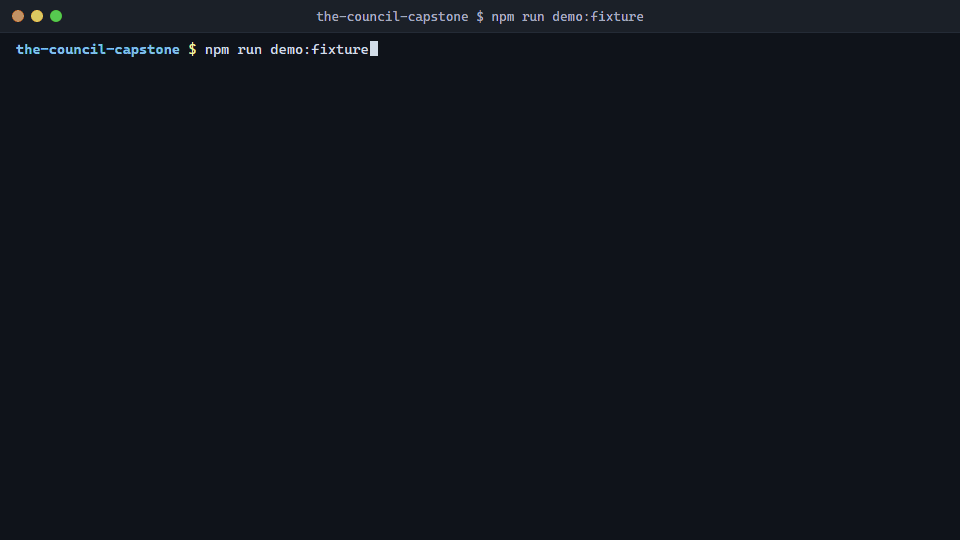
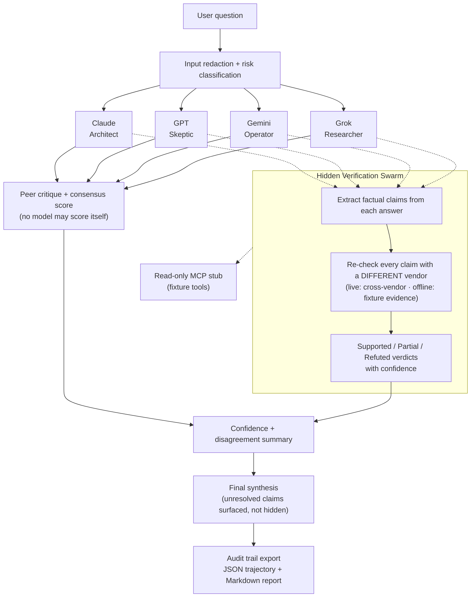

# The Council


The Council is a heterogeneous multi-model verification system that separates answer generation, peer critique, cross-vendor claim verification, and synthesis, using four vendors' fast-tier models (Claude Haiku 4.5, GPT-5.4 mini, Gemini 3.5 Flash, Grok 4.3) so that the verifier of a claim is never its author.

- **Status:** PUBLIC working system · fixture evidence is simulated · live evidence is captured, not a benchmark ([`sample_outputs/live_runs/`](sample_outputs/live_runs/)).
- **Research question:** Can heterogeneous models independently verify one another's claims better than peer review alone?
- **One result (one question, one run):** In the 2026-06-30 physics run, peers scored a GPT-5.4 mini answer 92, 95, and 98 and none flagged a wrong intermediate claim (electron kinetic energy stated as about 1.24 keV; it is about 1.5 eV). Cross-vendor re-derivation refuted that claim at 0.99 confidence and the synthesis dropped it. See [the receipt](#one-deliberation-receipt) and the [JSON audit trail](sample_outputs/live_runs/2026-06-30_writeup_run/q1_physics_photon_vs_electron.json).
- **Reproduce:** `npm run demo:fixture` (no keys, no network; simulated evidence). Live run with your own keys: [Quickstart](#quickstart).
- **Limitations:** one question is not an error rate; these are fast-tier models; no benchmark ships in this repository; cost was not recorded in the 2026-06-30 capture.
- **Deeper documentation:** [`KAGGLE_WRITEUP.md`](KAGGLE_WRITEUP.md) (Track: Freestyle), [`ARCHITECTURE.md`](ARCHITECTURE.md), [`eval/README.md`](eval/README.md), [`docs/mode-matrix.md`](docs/mode-matrix.md).

## Quickstart

### ▶ Start here — the live agent

The real thing: four models (Claude, GPT, Gemini, Grok) answer — most streaming token-by-token, Grok rendering on completion — the Council convenes for peer evaluation + a consensus score, and a **cross-vendor verification swarm** runs in parallel — every claim re-checked by a *different* vendor, with verdicts, confidence, and an audit trail.

**1. Add your provider keys** — copy `.env.example` to `.env` and fill in the keys you have:
`ANTHROPIC_API_KEY`, `OPENAI_API_KEY`, `GOOGLE_API_KEY`, `XAI_API_KEY`. *(Grok uses the OpenAI-compatible
SDK pointed at `api.x.ai`, so there are three SDK packages for four vendors.)*

**2. Install + run the three services** (cross-platform — macOS/Linux/Windows):

```bash
npm run live:install      # installs server + shadow-council + client deps (one time)
# then, in three terminals:
npm run live:server       # API on :3001
npm run live:shadow       # cross-vendor verifier on :3002
npm run live:client       # React UI on :5173
```

Open **http://localhost:5173**.

**Windows shortcut:** `launch.bat install-ui` then `launch.bat live` does all of the above in one command
(idempotent — it reuses anything already running and starts only what's down).

### Run without API keys (reproducibility / CI)

So anyone — including a judge without your keys — can run the pipeline end-to-end with **no keys and no network**, the same pipeline ships as a deterministic offline replay. This is what the automated tests run on and a "verify it works without my keys" fallback. Its evidence is **simulated** (it demonstrates the architecture, not live model quality — don't read it as live results):

```bash
npm run demo:fixture        # deterministic CLI dashboard; writes JSON + Markdown reports
```

On Windows: `launch.bat fixture`. Reports land in `sample_outputs/`.

## One deliberation receipt

A single row from a real run, so you can see what the Council does that a single answer or a peer review does not. Every value below is copied from the shipped audit trail at [`sample_outputs/live_runs/2026-06-30_writeup_run/q1_physics_photon_vs_electron.json`](sample_outputs/live_runs/2026-06-30_writeup_run/q1_physics_photon_vs_electron.json); open it rather than taking this table's word.

| | |
|---|---|
| **Question** | A photon and a free electron each have a de Broglie wavelength of exactly 1.0 nm. Which carries more total energy, and by what factor? |
| **Single-model answer (GPT-5.4 mini, Round 1)** | Reached the right conclusion: electron total energy about 511 keV, photon about 1.24 keV, ratio about 412. On the way it also asserted that the electron's kinetic energy is "approximately equal to the photon's energy of ~1.24 keV". That intermediate claim is wrong by a factor of about 830. |
| **Peer review (Round 2)** | The three other models scored GPT's answer 92, 95, and 98 out of 100. None flagged the kinetic-energy claim. |
| **Claim-level verification (Round 3)** | The answer was split into 8 claims. Claim `gpt-7`, the kinetic-energy statement, was routed to a different vendor for independent re-derivation (no web search; it is a reasoning claim) and came back **refuted at 0.99 confidence**: KE = p²/2m ≈ 1.5 eV, about 830 times smaller than the photon's energy. |
| **Per-model verification score** | Claude 100 (8/8 supported), Grok 93.8, Gemini 87.5 (1 refuted), GPT 81.3 (6 supported, 1 partial, 1 refuted). |
| **Synthesis** | Carried the correct 1.5 eV kinetic energy and the 511 keV total, with footnoted sources; the wrong intermediate did not survive. |
| **Latency** | Round 1 answers: 7.7 s (GPT), 9.9 s (Claude), 10.0 s (Grok), 19.5 s (Gemini). Round 3 verification and synthesis: 58.9 s. |
| **Cost** | Not recorded in this capture. The [eval CLI](eval/README.md) reports per-vendor token cost on live runs. |

What this shows: a fluent, correct-looking answer with a wrong step inside it passed peer review and failed claim-level verification. What it does not show: a general error rate. It is one question. Suite-level numbers come from `eval/run_eval.mjs`, which prints a Failures section for every row rather than only the catches.

## Validation

```bash
npm run verify:capstone     # demo:fixture + npm test + secret:scan + mcp:self-test
```

No install step needed — the entire offline path is dependency-free (`node:` builtins only), so a
fresh clone runs it immediately. (`npm run lint` is the exception; run `npm install` first.)

## What the live agent does

You ask a question; four models answer independently (with web search). You "Convene the Council" → peer evaluation surfaces strengths, weaknesses, disagreement, and a consensus score. In parallel, the **cross-vendor verification swarm** extracts each model's claims and re-checks them against a *different* vendor — so the verifier is never the author — producing Supported/Partial/Refuted verdicts with confidence and citations. The final verdict preserves confidence and unresolved claims instead of hiding uncertainty (effective trust, not a binary pass). The JSON audit trail records every critique and intermediate verdict — a **trajectory-style record** so a reviewer can confirm the answer was *earned*, not a "fragile success trap" reached by a flawed path.

**See it for real:** curated, redacted audit trails from an actual live run ship in
`sample_outputs/live_runs/` — including the run where the swarm refuted a winning-looking
kinetic-energy claim at **0.99 confidence** that peer review had missed.

### Why a council, not a single agent?

Multi-agent adds coordination cost, so it has to earn its place. It does here because the task is **high-stakes verification**: the value is exactly the disagreement, critique, and claim-checking a single prompt collapses. The pipeline "slices the elephant" — generation, critique, fact-checking, and synthesis are separate roles — so no single context has to generate *and* police itself, avoiding the context rot that degrades a monolithic prompt. A live run demonstrates this vividly: models often split on the answer, and the cross-vendor verification resolves it.

## Architecture



Live mode: React + Vite UI (`client/`) → Express API (`server/`) + Shadow Council verifier (`shadow-council/`). Offline mode: deterministic engine in `lib/fixtureCouncil.mjs`. See `ARCHITECTURE.md`, `docs/architecture.mmd`, `docs/mode-matrix.md`.

## Course Concepts Demonstrated

- **Model + harness (10/90):** the LLM is ~10%; the harness — redaction, role orchestration, tool allowlist, cross-vendor verification, synthesis — is the ~90% that makes the system trustworthy.
- **Multi-agent network, not a monolith ("slicing the elephant"):** four live models, peer critique, cross-vendor verification swarm, final synthesis — separated to avoid context rot, justified by the high-stakes verification goal.
- **Trajectory-aware evaluation + effective trust:** the audit trail exposes the reasoning journey of a *live* run (guards against the "fragile success trap"), not just a final output.
- **Security-first / least authority:** `.env` ignored, placeholders only, input redaction, input-risk classification, tool allowlist, secret scan. The keyless fixture mode also lets reviewers run safely. (`DEMO_GUIDE.md` includes a live prompt-injection demo question.)
- **Agent skills:** `skills/council-verification/SKILL.md` and `.claude/skills/add-fixture/`.
- **MCP (transport interoperability):** a dependency-free read-only MCP-style stub speaking JSON-RPC 2.0 over stdio at `mcp/server_stub.mjs` (honestly a stub, not a production SDK server).
- **Deployability + reproducibility:** the live app runs from one launcher command; a reproducible deploy path is documented; the deterministic offline mode reproduces the pipeline identically for CI.

See `COURSE_CONCEPTS.md`.

## Deployability

Deployment to a public endpoint is **not required** for judging (per the competition rubric), and we don't host the live app publicly (it runs on private keys — a no-login public endpoint would be an abuse/cost risk). The live agent is demonstrated in the **video**, and this **public repo with the setup steps above** is the project link. A reproducible deploy path is documented in `docs/` for anyone who wants to host it.

## Screenshot Assets

Public-safe helper pages in `screenshots/` (`cover.html`, `architecture.html`, `demo-output.html`) for Kaggle/GitHub/video stills. They contain only public-safe content.

## Repository Structure

```text
client/                         React 19 + Vite live UI (the agent's front end)
server/                         Express live API (orchestrates the 4 models)
shadow-council/                 Cross-vendor verification service
lib/                            Deterministic offline engine + security helpers
mcp/                            Read-only MCP-style stub
skills/council-verification/    Reusable Council verification skill
fixtures/                       Offline fixture data (no-key reproducibility)
sample_outputs/                 Generated fixture reports
screenshots/                    Public-safe screenshot helper pages
submission_assets/              Kaggle/GitHub submission helper docs
docs/                           Architecture, mode matrix, deploy notes
tests/                          Smoke tests (run on the offline engine)
```

## Known Limitations

- Live mode needs your own provider keys and provider availability; it costs money per run.
- The offline fixture mode is **simulated** — it proves the architecture and powers CI, not live model quality.
- The MCP server is a small dependency-free stub, not a production MCP SDK server.

## License Status

An MIT-style `LICENSE` is included (OSI-approved, compatible with the competition's CC-BY-4.0 winner license). See `LICENSE_REVIEW.md`.

**Part of the Simone Systems Research program.** [SEED](https://github.com/thisisntjon/seed-protocol) measures whether agent-driven work constitutes verified progress. [BigBoss](https://github.com/thisisntjon/bigboss-approval-plane) controls which autonomous actions can occur and preserves human decision authority. The Council tests independent verification through heterogeneous model families. [The Bus](https://github.com/thisisntjon/thebus) shows adversarial review terminating a bad architecture before further implementation. [Godot Methodology](https://github.com/thisisntjon/godot-ai-methodology) tests whether the same verification principles generalize into software architecture. Founder-led, independent: [simoneresearch.com](https://simoneresearch.com). Independent reproductions: file one with the [reproduction issue template](.github/ISSUE_TEMPLATE/independent-reproduction.md).
